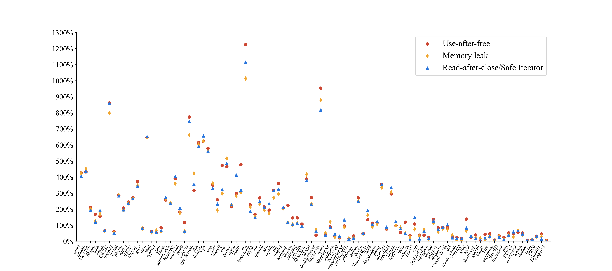
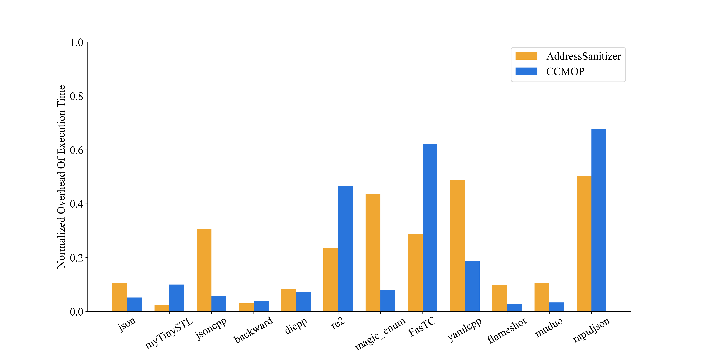
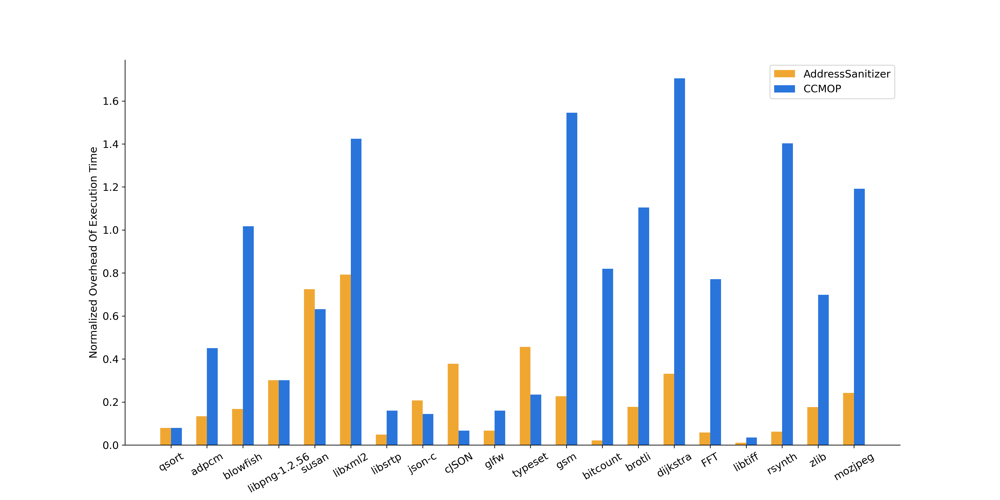

# Evaluation
We evaluated **CCMOP** for 100 real-world C/C++ programs. We collected the compilation time of each project for different properties. For runtime overhead, we evaluated CCMOP on the programs using **Use-afer-free** property. All the experiments were carried out on a laptop with a 2.60GHz CPU and 32G memory, and the operating system is Ubuntu 20.04. The result values are the averaged values of three runs within **-O3**.

## [](#header-2) **1. Benchmark**

The 50 real-world C++ programs are as follows.

Benchmark（CXX）|Category|Compile Command|Lines(K lines)
| :----: | :----: | :----: |:----: |
jsonCPP|Funzzbench|cmake ..;make|10.5
re2|Funzzbench|cmake ..;make|29
harfbuzz|Funzzbench|cmake ..;make|110
json|Funzzbench|cmake ..;make|102
bloty|Funzzbench|cmake ..;make|538.6
PROJ|Funzzbench|cmake ..;make|212
di|Github|cmake ..;make|24.6
cgbot|Github|cmake ..;make|12.6
spdlog|Github|cmake ..;make|24
fmt|Github|cmake ..;make|44
simdjson|Github|cmake ..;make|78
googletest|Github|cmake ..;make|42
flameshot|Github|cmake ..;make|50
sqlpp11|Github|cmake ..;make|59
2048|Github|cmake ..;make|2.7
SQLiteCPP|Github|cmake ..;make|156
git-crypt|Github|make|3.7
double-conversion|Github|cmake ..;make|322.9
tinyrendere|Github|cmake ..;make|1.2
tinyserver|Github|make|1
TinyWebServer|Github|make|2.1
abseil|Github|cmake ..;make|165
backward|Github|cmake ..;make|4
easy3D|Github|cmake ..;make|13.3
brpc|Github|cmake ..;make|239
capnproto|Github|cmake ..;make|210
Catch2-devel|Github|cmake ..;make|48.1
coost|Github|cmake ..;make|37
FasTC|Github|make|53.7
cxxopts|Github|cmake ..;make|12.3
docopt.cpp|Github|cmake ..;make|2.7
FTXUI|Github|cmake ..;make|24
glob|Github|cmake ..;make|10.4
guetzli|Github|cmake ..;make|8.3
lepton|Github|cmake ..;make|63
libfacedetection|Github|cmake ..;make|3
libutp|Github|make|4.1
libzmp|Github|cmake ..;make|62
nana|Github|cmake ..;make|72
Magic_enum|Github|cmake ..;make|19
simplejson|Github|cmake ..;make|1.5
muduo|Github|cmake ..;make|36
MyTinySTL|Github|cmake ..;make|19.3
ncnn|Github|cmake ..;make|675.2
pybind11|Github|cmake ..;make|25
Range-v3|Github|cmake ..;make|77
rapidjson|Github|cmake ..;make|30
tinyxmil2|Github|cmake ..;make|5.5
WebServer|Github|cmake ..;make|10.4
yaml-cpp|Github|cmake ..;make|80.4

The 50 real-world C programs and the programs in movec-minibench are as follows.

Benchmark（C）|Category|Compile Command|Lines(K lines)
| :----: | :----: | :----: | :----: |
cJSON|Fuzzbench|make build;cd build;cmake ..;make|15.2
libarchive|Fuzzbench|make build;cd build;cmake ..;make|154.4
libjpeg|Fuzzbench|make build;cd build;cmake ..;make|13.2
libgit2|Fuzzbench|make build;cd build;cmake ..;make|24.5
libcap|Fuzzbench|./configure;make|52
libtiff|Fuzzbench|make build;cd build;cmake ..;make|68.4
libpng|Fuzzbench|make build;cd build;cmake ..;make|24.7
libxml2|Fuzzbench|make build;cd build;cmake ..;make|228.5
mation|Fuzzbench|make build;cd build;cmake ..;make|21.6
mbedlts|Fuzzbench|make build;cd build;cmake ..;make|107.7
zlib|Fuzzbench|./configure;make|18.8
zstd|Fuzzbench|make|72.2
movec-msbench (126 small programs)|Movec|make|2.4
libuuid|Ferry|./configure;make|22
tcpdump|Ferry|./configure;make|79.5
ogg|Ferry|cmake ..;make|2.5
czmq|Github|cmake ..;make|51.3
libstrip|Github|cmake ..;make|19.1
libavf|Github|cmake ..;make|22.3
json-c|Github|cmake ..;make|11
glfw|Github|cmake ..;make|70.7
curl|Github|cmake ..;make|169.1
raylib|Github|cmake ..;make|239.5
kcp|Github|cmake ..;make|3.5
zaver|Github|cmake ..;make|2.6
naomsg|Github|cmake..;make|23.4
mozjpeg|Github|cmake..;make|63.5
brotil|Github|cmake..;make|34.8
parson|Github|cmake ..;make|3
libxlst|Github|cmake ..;make|34.8
cpu-feature|Github|cmake ..;make|2.1
luna|Github|make|3.8
mon|Github|make|1.8
gc|Github|make|1.5
pwnat|Github|make|2.1
adpcm|Github|make|0.51
basicmath|Github|make|3.5
Bitcount|Github|make|5.3
Blowfish|Github|make|1.4
CRC32|Github|make|0.12
Dijkstra|Github|make|0.28
FFT|Github|make|0.28
Gsm|Github|make|4.9
Patricial|Github|make|0.28
Qsort|Github|make|0.1
Rsynth|Github|make|5.5
Sha|Github|make|0.2
Stringsearch|Github|make|3
Susan|Github|make|1.4
typeset|Github|make|28.6
kilo|Github|make|1.1


The properties used in the evaluation are as follws. 

Type|Property Name |Description
| :----: | :----: | :----: |
C|Use-after-free|Pointer is dereferenced after freed(**free**)
C|Memory leak|Memory is allocated(**malloc**) results but not freed(**free**)
C|Read-after-close|A **FILE** is read after close
C++|Use-after-free|Pointer is dereferenced after freed(**delete**)
C++|Memory leak|Memory is allocated(**new**) but not freed(**delete**)
C++|Safe Iterator|A collection should be updated when it is being iterated

There are two properties, i.e., use-after-free and memory-leak, are used for both C and C++ programs. However, the event definations of them are different. We weave monitors when calling **malloc** and **free** in C programs, and we weave monitors to the **new** and **delete** statements in C++ programs.


## [](#header-2) **2. Evaluation results**
The evaluation results contain the compilation time for 100 real-world C/C++ programs and the runtime overhead only for C/C++ programs with valid test drivers.
### [](#header-3)**(1).Compilation Time**
We evaluate each C/C++ program for three properties. For C programs, the properties are Use-after-free, Memory-leak, and Read-after-close. For C++ programs, the properties are Use-after-free, Memory-leak, and Safe-Iterator. In addition, the common properties have different pointcuts for different languages. The results of compilation time are shown as follows.

The columns labeled **Average-O**, **Average-U**, **Average-M**, and **Average-R/U** represent the average of three test values of Original compilation, RV for Use-after-free, RV for Memory-leak and RV for Read-afer-close or Safe-Iterator respectively. The rows labeled **Overhead-*** means the average compilation time with RV (denoted **C<sub>RV</sub>**) overhead compared with the average original compilation time (denoted **C<sub>O</sub>**); that is **(C<sub>RV</sub>-C<sub>O</sub>)/C<sub>O</sub>**. In addition, the former 50 programs are  C programs, and the latter 50 are C++ programs.  

name|Average-O(s)|Average-U(s)|Average-M(s)|Average-R/U(s)|Overhead-UAF|Overhead-MF|Overhead-R/U
| :----: | :----: | :----: | :----: | :----: | :----: |:----: | :----: |
qsort|0.283333333|1.49|1.483333333|1.433333333|4.258823529|4.235294118|4.058823529
adpcm|0.293333333|1.56|1.613333333|1.57|4.318181818|4.5|4.352272727
blowfish|0.586666667|1.83|1.766666667|1.723333333|2.119318182|2.011363636|1.9375
libpng-1.2.56|7.84|21.03333333|17.60666667|17.25|1.682823129|1.245748299|1.200255102
luna|0.79|2.023333333|2.126666667|2.3|1.561181435|1.691983122|1.911392405
susan|0.875|1.456666667|1.443333333|1.473333333|0.664761905|0.64952381|0.683809524
CRC32|0.14|1.346666667|1.256666667|1.343333333|8.619047619|7.976190476|8.595238095
libxml2|100.2633333|160.62|152.2433333|149.3033333|0.601981449|0.518434788|0.489112005
pwnat|0.41|1.583333333|1.593333333|1.57|2.861788618|2.886178862|2.829268293
libsrtp|9.25|28.41666667|27.25666667|27.33333333|2.072072072|1.946666667|1.954954955
json-c|12.69666667|43.70333333|42.61666667|42.39666667|2.44211079|2.356524022|2.33919664
cJSON|6.173333333|22.93666667|22.59666667|22.55|2.715442765|2.660367171|2.652807775
libpcap|9.793333333|46.23|43.74333333|43.38|3.720558203|3.466643975|3.429543907
glfw|54.46666667|98.59666667|97.77666667|97.55|0.810220318|0.795165239|0.791003672
mon|0.173333333|1.293333333|1.293333333|1.303333333|6.461538462|6.461538462|6.519230769
zstd|74.79|119.9466667|116.6033333|119.62|0.603779471|0.559076525|0.599411686
typeset|12.46333333|19.03|20.79333333|19.27333333|0.526878845|0.668360524|0.546402781
gsm|1.936666667|3.553333333|3.133333333|3.213333333|0.834767642|0.617900172|0.659208262
czmq|9.57|34.11333333|34.96666667|35.57666667|2.564611634|2.653779171|2.717520028
stringsearch|0.623333333|2.1|2.11|2.093333333|2.368983957|2.385026738|2.35828877
nanomsg|16.69333333|81.6|76.57333333|83.99333333|3.888178914|3.587060703|4.031549521
bitcount|0.69|1.94|1.903333333|2.11|1.811594203|1.758454106|2.057971014
brotli|31.33|68.22|50.71666667|50.65|1.177465688|0.618789233|0.616661347
patricia|0.226666667|1.98|1.726666667|1.92|7.735294118|6.617647059|7.470588235
cpu_feature|2.29|9.526666667|11.98|10.38666667|3.160116448|4.231441048|3.5356623
sha|0.286666667|2.046666667|2.013333333|1.983333333|6.139534884|6.023255814|5.918604651
dijkstra|0.29|2.096666667|2.096666667|2.193333333|6.229885057|6.229885057|6.563218391
FFT|0.33|2.24|2.18|2.176666667|5.787878788|5.606060606|5.595959596
ogg|2.663333333|11.98|12.24666667|11.40666667|3.498122653|3.59824781|3.282853567
zaver|2.696666667|9.663333333|7.9|8.933333333|2.583436341|1.929542645|2.312731768
libavif|3.586666667|20.51|14.26|15.10333333|4.718401487|2.975836431|3.210966543
kilo|0.316666667|1.79|1.95|1.85|4.652631579|5.157894737|4.842105263
parson|0.953333333|2.996666667|3.1|3.123333333|2.143356643|2.251748252|2.276223776
matio|9.333333333|37.08666667|35.61|47.90333333|2.973571429|2.815357143|4.1325
libtiff|20.02333333|115.3966667|80.86666667|83.94|4.763109705|3.038621608|3.192109206
gc|0.19|2.516666667|2.116666667|2.31|12.24561404|10.14035088|11.15789474
basicmath|0.62|2.03|1.94|1.78|2.274193548|2.129032258|1.870967742
raylib|46.35666667|123.9666667|118.0066667|114.7633333|1.674192853|1.545624506|1.47565974
cur|34.73666667|128.56|115.04|120.5166667|2.700988389|2.311774302|2.469436714
libuuid-1.0.3|7.87|24.75666667|23.07333333|24.52|2.145700974|1.931808556|2.115628971
kcp|1.31|3.85|3.593333333|4.373333333|1.938931298|1.743002545|2.338422392
rsynth|1.763333333|7.363333333|6.556666667|7.313333333|3.175803403|2.718336484|3.147448015
zlib|3.576666667|16.43|14.09666667|15.17666667|3.593662628|2.941286114|3.243243243
libgit2|101.5933333|310.3833333|309|316.4333333|2.055154538|2.041538159|2.114705689
tcpdump|42.9|138.9366667|92.98333333|93.42333333|2.238616939|1.167443667|1.177700078
libjpeg|83.14|204.3966667|170.4333333|170.02|1.458463636|1.049955898|1.044984364
mozjpeg|57.52|141.4366667|122.6733333|122.4733333|1.458912842|1.132707464|1.129230413
mbedtls|111.24|230.24|214.92|214.5633333|1.069759079|0.932038835|0.928832554
libarchive|74.21|361.6266667|383.2733333|354.6333333|3.873018012|4.164712752|3.778780937
libxlst|8.393333333|31.16666667|27.85666667|27.61|2.713264496|2.318903892|2.289515488
double-conversion|21.93333333|30.34|38.17|35.4|0.383282675|0.740273556|0.613981763
tinyserver|0.433333333|4.566666667|4.243333333|3.98|9.538461538|8.792307692|8.184615385
tgbot-cpp|25.17666667|36.35|37.88666667|34.77|0.443797167|0.504832517|0.381040646
WebServer|8.883333333|16.89|19.62666667|16.61333333|0.901313321|1.209380863|0.870168856
simdjson|9.41|12.50333333|11.76333333|13.74|0.328728303|0.250088558|0.460148778
backward-cpp|11.82|14.30333333|14.77333333|15.58|0.210095883|0.249858996|0.318104907
TinyWebServer|2.916666667|5.686666667|5.453333333|6.786666667|0.949714286|0.869714286|1.326857143
MyTinySTL|23.52|27.41|27.87|26.56|0.165391156|0.18494898|0.129251701
yaml-cpp|142.79|190.3366667|174.06|170.5533333|0.332983169|0.218992927|0.194434718
spdlog-1.x|1.706666667|6.333333333|5.97|5.966666667|2.7109375|2.498046875|2.49609375
docopt.cpp|4.17|6.253333333|6.09|6.21|0.49960032|0.460431655|0.489208633
SimpleJSON|2.14|4.996666667|5.61|6.243333333|1.334890966|1.621495327|1.917445483
2048|8.326666667|17.71666667|15.77|17.17666667|1.127702162|0.893915132|1.06285028
tinyrendere|4.21|9.1|8.706666667|9.373333333|1.16152019|1.068091845|1.226444972
libutp|1.7|7.736666667|7.39|7.696666667|3.550980392|3.347058824|3.52745098
git-crypt|6.553333333|11.48666667|11.86333333|12.32|0.752797558|0.810274669|0.879959308
tinyxml2|1.376666667|5.43|5.59|5.966666667|2.944309927|3.060532688|3.334140436
libfacedetection|4.806666667|9.466666667|9.523333333|10.74|0.969486824|0.981276006|1.234396671
harfbuzz|52.19333333|80.86666667|96.77333333|92.77666667|0.549367735|0.854132073|0.777557798
nana|112.1333333|245.7666667|169.92|168.5733333|1.191736029|0.515338882|0.50332937
cxxopts|43.58|59.46|55.05666667|46.18666667|0.364387334|0.263347101|0.05981337
FasTC|52.09666667|107.7|91.01333333|129.5033333|1.067310768|0.747008766|1.485827628
json|901.33|1245.276667|1171.653333|1037.573333|0.381599044|0.29991605|0.151158103
SQLiteCpp|21.93333333|30.34|38.17|35.4|0.383282675|0.740273556|0.613981763
rapidjson|274.64|341.1866667|310.4266667|325.6066667|0.242305078|0.130303913|0.18557627
libzmq|116.4366667|276.0306667|248.2766667|263.7733333|1.370650711|1.13228937|1.265380321
sqlpp11|185.6333333|341.0833333|291.0933333|320.0733333|0.837403484|0.568109176|0.724223379
di-cpp14|200.7833333|375.21|356.2633333|375.62|0.868730804|0.774367062|0.870772807
Catch2-devel|57.98666667|107.06|101.0066667|117.5766667|0.846286503|0.741894688|1.027650034
re2|75.95333333|95.14666667|104.2566667|92.20333333|0.252699026|0.372641095|0.213947161
magic_enum|301.45|374.0933333|314.7366667|354.9866667|0.240979709|0.044075856|0.177597169
jsoncpp|37.48333333|43.81666667|38.84|44.25333333|0.168963984|0.036193864|0.180613606
glog|37.51666667|89.17333333|62.03333333|68.59|1.376899156|0.653487339|0.828254109
coost|165.22|205.4366667|214.3033333|217.1033333|0.243412823|0.297078643|0.314025743
abseil-cpp|118.1966667|163.7133333|142.97|136.9533333|0.385092642|0.209594179|0.158690318
guetzli|52.53333333|53.65333333|62.27666667|53.55|0.021319797|0.185469543|0.019352792
bloaty|172.0133333|246.34|190.3566667|208.0566667|0.432098287|0.10663902|0.20953802
brpc|601.4033333|882.1733333|779.3466667|790.9833333|0.466858071|0.295880191|0.31522938
capnproto|599.9933333|651.9566667|624.7|608.9266667|0.086606518|0.041178235|0.014889054
Easy3D|574.9833333|771.9666667|754.3133333|727.5466667|0.34258964|0.311887301|0.265335227
flameshot|230.88|288.28|260.9233333|254.8866667|0.248613999|0.130125318|0.103978979
fmt|221.41|336.4233333|304.3866667|304.12|0.519458621|0.374764765|0.373560363
FTXUI|190.9066667|283.5833333|241.4066667|302.8733333|0.485455371|0.264527169|0.586499511
googletest|279.1866667|434.1166667|466.9333333|463.83|0.554933378|0.672477196|0.661361574
lepton|217.5663333|329.25|307.81|317.4833333|0.513331566|0.414786908|0.459248444
muduo|359.1833333|382.14|365.38|382.8633333|0.063913507|0.0172521|0.065927335
ncnn|557.1033333|613.9533333|605.7066667|618.9466667|0.102045701|0.087242941|0.11100873
PROJ|556.3733333|731.47|710.4633333|736.7033333|0.314710746|0.276954323|0.3241169
pybind11|515.8033333|747.7086667|663.3833333|589.0166667|0.4496003|0.286116802|0.141940404
range-v3|933.6133333|989.77|945.259|937.71|0.060149812|0.012473758|0.004387969
Avg|||||2.013295688|1.845237083|1.916637252

The following figure shows the above data, where the X-axis shows the project names, and the Y-axis shows the value of compilation overhead.



The above figure or table shows that the compilation overhead of the majority (78%) of the C/C++ programs is below 300%. There are some programs whose compilation overhead exceeds 500%, with most of the overall compilation time occupied by the monitor library building stage. You can download the original data of the three runs from the following link.  
[Download](resources/compilelist.csv)

### [](#header-3)**(2).Runtime Overhead**

We evaluate the runtime overhead for the Use-after-free property. We did experiments on **AddressSanitizer** within **-O3** for comparison. We use the below compilation options of **AddressSanitizer**; We expect these options to suppress other checkers.
```code
 -O3 -fsanitize=address  -fsanitize-recover=address  -mllvm -asan-stack=0 -mllvm -asan-globals=0 -fno-sanitize-address-use-after-scope 
export ASAN_OPTIONS=detect_container_overflow=0:detect_leaks=0:leak_check_at_exit=0:check_printf=0:detect_container_overflow=0:buffer_overflow=0:report_globals=0:detect_stack_use_after_return=0:new_delete_type_mismatch=0:alloc_dealloc_mismatch=0:poison_heap=0:poison_partial=0:protect_shadow_gap=0:check_malloc_usable_size=0:allow_user_poisoning=0:replace_intrin=0:replace_str=0
```
Out of the 100 real-world programs, those without drivers or a runtime overhead of AddressSanitizer or CCMOP lower than **5%** are not shown. In addition, the programs on which Sanitizer fails have not been listed. The evaluation results of valid C++ programs are shown below.
  
name|Avg-Origin(s)|Avg-AddressSanitizer(s)|Avg-CCMOP(s)|Overhead-SAN|Overhead-CCMOP
| :----: | :----: | :----: | :----: | :----: | :----: |
backward-cpp|0.55|0.59|0.6|0.072727273|0.090909091
MyTinySTL|196.7266667|208.0233333|247.5933333|0.057423159|0.258565184
jsoncpp|2.393333333|4.853333333|2.726666667|1.027855153|0.139275766
json|452.1333333|577.8033333|509.71|0.277948983|0.127344441
di-cpp14|60.88666667|73.74666667|71.91|0.211212088|0.181046754
muduo|63.58333333|80.92333333|68.67666667|0.272712975|0.080104849
magic_enum|0.05|0.136666667|0.06|1.733333333|0.2
FasTC|0.11|0.213333333|0.46|0.939393939|3.181818182
yaml-cpp|0.22|0.676666667|0.34|2.075757576|0.545454545
flameshot|0.596666667|0.746666667|0.636666667|0.251396648|0.067039106
re2|1.163333333|2.003333333|3.41|0.722063037|1.931232092
rapidjson|0.62|1.98|2.95|2.193548387|3.758064516
Avg||||0.819614379|0.88007121


We draw a figure to represent the above data as follows. The X-axis is the project name, and the Y-axis is **log<sub>10</sub><sup>Overhead-RV+1</sup>**.  



If you are interested in the data from the three test runs, you can download it by clicking the following link.  
[Download](resources/cxx_runtime.csv)  

The evaluation results of the C programs are shown below.  


name|Avg-Origin(s)|Avg-AddressSanitizer(s)|Avg-CCMOP(s)|Overhead-SAN|Overhead-CCMOP
| :----: | :----: | :----: | :----: | :----: | :----: |
qsort|0.05|0.06|0.06|0.2|0.2
adpcm|0.323333333|0.44|0.913333333|0.360824742|1.824742268
blowfish|0.12|0.176666667|1.25|0.472222222|9.416666667
libpng-1.2.56|0.02|0.04|0.04|1|1
susan|0.296666667|1.573333333|1.27|4.303370787|3.280898876
libxml2|0.493333333|3.06|13.09|5.202702703|25.53378378
libsrtp|14.39|16.10333333|20.77666667|0.119064165|0.443826732
json-c|21.96333333|35.37666667|30.61666667|0.610714828|0.393989983
cJSON|0.06|0.143333333|0.07|1.388888889|0.166666667
glfw|0.06|0.07|0.086666667|0.166666667|0.444444444
typeset|0.07|0.2|0.12|1.857142857|0.714285714
gsm|0.116666667|0.196666667|4.093333333|0.685714286|34.08571429
bitcount|0.066666667|0.07|0.44|0.05|5.6
brotli|0.523333333|0.786666667|6.653333333|0.503184713|11.7133758
dijkstra|0.023333333|0.05|1.183333333|1.142857143|49.71428571
FFT|0.07|0.08|0.413333333|0.142857143|4.904761905
libtiff|1.03|1.056666667|1.116666667|0.025889968|0.084142395
rsynth|0.13|0.15|3.286666667|0.153846154|24.28205128
zlib|0.02|0.03|0.1|0.5|4
mozjpeg|3.503333333|6.113333333|54.41333333|0.745004757|14.53187441
Avg||||0.981547601|9.616775546


Some programs listed above frequently involve memory operations and have a higher overhead for CCMOP, which increases the average value. Besides, the figure is as follows.

  

If you are interested in the data from the three test runs, you can download it by clicking the following link.  
[Download](resources/c_runtime.csv)

## [](#header-2)**3.Evaluation reproduction**

We provide the scripts for reproducing our evaluation. Before running the following command, you need to confirm that **wac, CCMOP/bin** in your **PATH** and export the **<CCMOP/lib>** to **ASPECT_LIB**. For the evaluation of the compilation test, you can run the following command:
```shell
python3 test_compileTime.py
```
If the above command succeeds, you can see **compilelist.csv** and **compilelist.pdf** in your current directory. For the evaluation of the runtime overhead test, you can run the following command:
```shell
python3 test_runtimeOverhead.py
```
If the above command succeeds, you could see **c_runtime.csv**,**cxx_runtime.csc**,**c_runtime.pdf** and **cxx_runtime.pdf** in your current directory.  In addition, the runtime PDF is a figure drawn with the data in the CSV file and filters out some invalid data.

# [](#header-1)**Contacts**

Please feel free to contact us if you have any questions about **CCMOP**.

*   <font color="#0000FF" size="4">Yongchao Xing (xingyc0979@nudt.edu.cn)</font>

*   <font color="#0000FF" size="4"> Zhenbang Chen (zbchen@nudt.edu.cn)</font>
