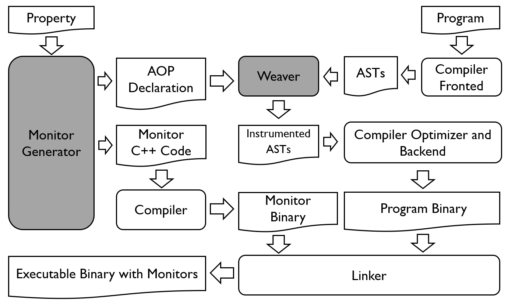

# **Introduction to CCMOP**

## **Motivation**
C/C++ programs widely exist. However, existing runtime verification (RV) tools(e.g., AddressSanitizer and Memcheck) for C++ programs only support the detection of memory-related errors or exceptions. As far as we know, no Runtime verification(RV) tools are specially designed for C++ programs and support the RV for general properties. **CCMOP** is a RV tool specially designed for C++ programs, which supports the RV of general properties. 

## **CCMOP's Framework**
Insides **CCMOP**, we designed the framework based on JavaMOP and implemented the instrumentation at the AST level. The framework of **CCMOP** is shown in the following figure.  

 

 

The inputs of **CCMOP** are a program and the property to verify. **CCMOP** accepts the property and generates an AOP Declaration and Monitor code in C++. The AOP Declaration will be fed to Weaver, which weaves the monitor interface to the input program at the AST level. The instrumented AST will be passed to the compiler's backend and compiled into an object. The Monitor code will be compiled as a monitor binary with compilation option **-O3**. In the linking stage, the binaries mentioned above will be linked together to generate an executable with monitors.

# **Contacts**

Please feel free to contact us if you have any questions about **CCMOP**.

*   Yongchao Xing (xingyc0979@nudt.edu.cn)

*    Zhenbang Chen (zbchen@nudt.edu.cn)

