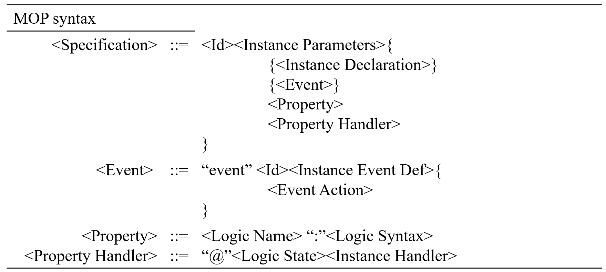
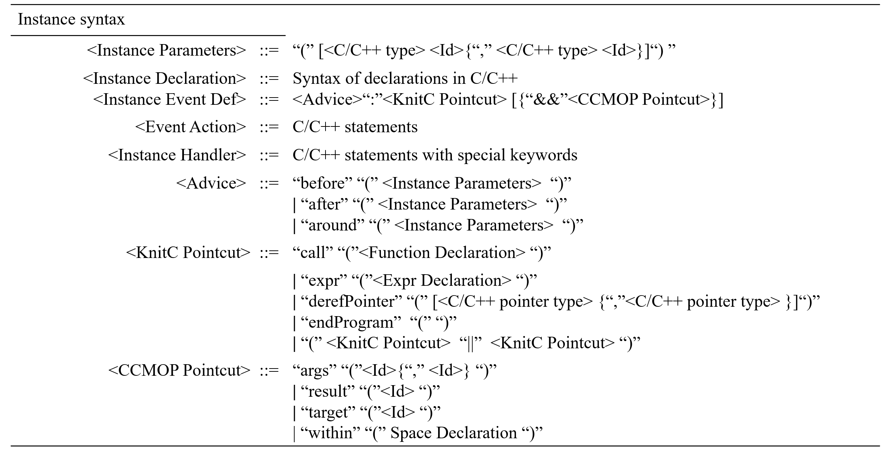

# [](#header-1)**Manual for CCMOP**

Here we give a brief manual for using **CCMOP**. There are three parts. The first part is the manual for installing and running the docker image of **CCMOP**. The second part is the usage of the transparent compilation script **wac**. The final part is a brief account of the syntax of the property.  


## [](#header-2)**1.Install and Run the Docker Image**


### [](#header-3)**(1).Install and start docker**

We suppose you have installed the **docker** environment; otherwise, please go to this [link](https://docs.docker.com/get-docker/) for help.
### [](#header-#)**(2).Download CCMOP docker image**
The following command will download the [image](https://hub.docker.com/r/ccmop/ccmop) named **ccmop/ccmop**.
```shell
docker pull ccmop/ccmop
```
If the image downloading succeeds, you can use the following command to check.

```shell
docker images
```
You should see that an image named **ccmop/ccmop** exists.

## [](#header-2)**(3).Run the docker image**

You can run the docker image and have a try. The following command will create a container for **ccmop/ccmop** and open the terminal.
```shell
docker run -it ccmop/ccmop /bin/bash
```
Get in the **CCMOP/examples/CXX/UnSafeIterator** directory and compile an example program.
```shell
cd CCMOP/examples/CXX/UnSafeIterator
wac -cxx -mop UnSafeIterator.mop test.cpp -o a
./a
```
If the commands above succeed, you can see the results in bash.

NOTE: If you use **CCMOP** not in our supplied docker [image](https://hub.docker.com/r/ccmop/ccmop), you should run the following commands to initialize the environmental variables, and the clang version should be 15.02 with **Release** type.
- Exports required binary and library path.
```shell
export PATH=$PATH:<The bin of CCMOP>
export ASPECT_LIB=<The lib of CCMOP>
```
- Install the script of **wac**, in directory wcompiler
```shell
python3 setup.py install
```  

## [](#header-2)**2.Usage of wac**

We show the usage of **wac** as follows.  

### [](#header-3)**(1). Common arguments**

The following command will list all the arguments.
```shell
wac  -h
```
The argument **-print** will dump the instrumented file.
```shell
wac  -print
```
### [](#header-3)**(2). Compile model**

There are two models of WAC, one for project compilation and another for single-file compilation.  
- for single-file compilation:  
    - Using the argument **-cxx** will inform the compiler that the current file is to be compiled as a C++ file.  
    - The argument **-mop** specifies the input property's path.  
    - The contents of **Clang compile arguments** are the arguments that Clang supports.  
```shell
wac  [-cxx] [-print] -mop <A property file> <Clang compile arguments>
```

- for project compilation:   
    - Using the argument **-proj** will turn the compiling model into project compilation. 
```shell
wac  [-print] -proj <The path of configure JSON.>
```
The **configure JSON** contains the required information, as shown below.
```json
{
  "project_name":"", 
  "compile_language": "",
  "project_root_dir":"",
  "mop_file":"",
  "project_build_subdir":"",
  "project_compile_cmd":""
}
```
- **project_name** is the name of the target project.  
- **compile_language** could be **c** or **cxx**, which is the language of the target project.  
- **project_root_dir** means the path of the root path of the target project, which could be an absolute path or a path related to **configure JSON**.    
- **mop_file** represents the path of a property, which could be an absolute path or a path related to **configure JSON**.  
- **project_build_subdir** means the build directory that is often used in **CMake**.  
- **project_compile_cmd** represents the command to compile the target project; if there are multiple commands, please use **;** to split.
   
**Note**: if you need to run CMake for the C program, you may need to add the following argument 
```shell
-DCMAKE_C_COMPILER_ID=Clang
```
**Note**: if you need to monitor a program that only generates a static library, you may need to explicitly specify AR as **${war}**.

## [](#header-2)**3.Property Syntax**

The syntax of the property is designed based on JavaMOP's MOP syntax. We show the property syntax (not AOP syntax) with a file extension as **.mop**. The symbol **[]** represents an optional occurrence (either once or none), while the symbol **{}** represents a repeating occurrence (either once or multiple times).  

### [](#header-3)**(1). MOP syntax**
  
The MOP syntax describes the top syntax of the property.
- **Specification** is the main entity of MOP.
- **Event** is the essential component of **Specification**.
- **Property** is a logic expression that describes the behavior of event streams.
- **Logic Name** could be **ere** or **fsm**, which is the lanaguage for specifying properties.
- **Property Handler** is the action that the monitor will carry out when reaching a desired state.



### [](#header-3)**(2).Instance syntax**

The Instance syntax describes the syntax involved in MOP syntax.  
- **Instance parameters** in **Advice** are the subset of Specification parameters, representing the current event focus.   
- **Id** in CCMOP Pointcut is mapping to the **Instance parameters** in **Advice**.  
- **args** means get the argument of matching pointcut, and the contents of args may be **(none, Id)**, which means get the second argument from pointcut.  
- **result** means getting the matching pointcut's return value.  
- **target** means getting the object that owns the matching pointcut.  
- **within** limits the mathching scope by **Space Declaration**.
- **call** matches the call sites which the callee functions that conform to the **Function Declaration**.  
- **expr** matches the new, delete and construct call sites that conform to **Expr Declaration**.  
- **derefPointer**  matches all the site of dereferencing pointers that conforms to the pointer type.  
- **endProgram**  mathces all the exits of prgrams including **return statement** in main function and **exit** callsites.  

 

By the way, when **derefPointer** encounters situations where code instrumentation may alter the program semantics, we ignore such instrumentations.
### [](#header-3)**(3).AOP syntax**
  
The following syntax describes the core feature of our AOP language designed for C++ programs.  
- **%** in **Function Declaration** means that this declaration does not focus on the return type.  
- **...** in  **Function Declaration** and **Expr Declaration** means that the declaration does not focus on the args.  
- **\*** in **Expr Declaration** and **Expr Name** means this declaration does not focus on the specified type of Expr.  
- **Scoped Type** represents the C++ type with namespace and  **\*** are the pointer symbol.  
- **Space Declaration** represents either namespace scope or function scope. If **( )** appears at the end of **Space Declaration**, the final scope is function scope; otherwise, it is namespace scope.  
- **Special Keywords** contains **__RESET**, **TARGET** and **LOC**.  
    - **_RESET** means resetting the current monitor's state.  
    - **TARGET** means the current monitor, which is generally used in dumping the monitor member information.  
    - **LOC** means the location of the current event occurs.  
 


# [](#header-1)**Contacts**

Please feel free to contact us if you have any questions about **CCMOP**.

*   <font color="#0000FF" size="4">Yongchao Xing (xingyc0979@nudt.edu.cn)</font>

*   <font color="#0000FF" size="4"> Zhenbang Chen (zbchen@nudt.edu.cn)</font>